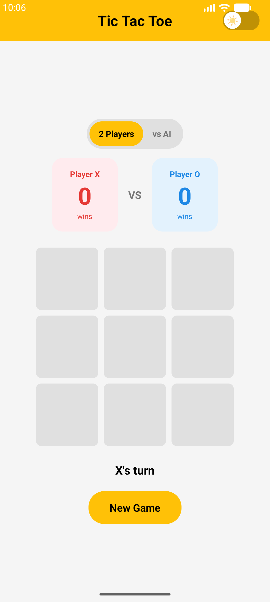
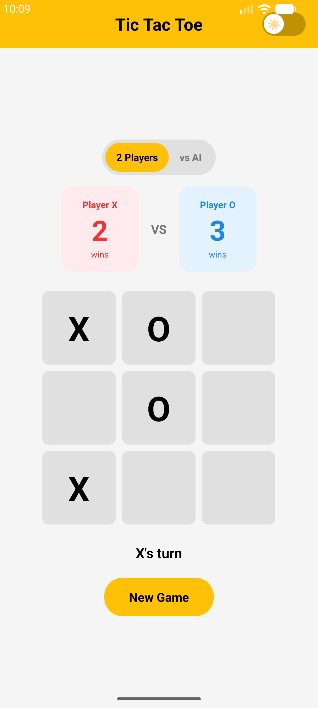
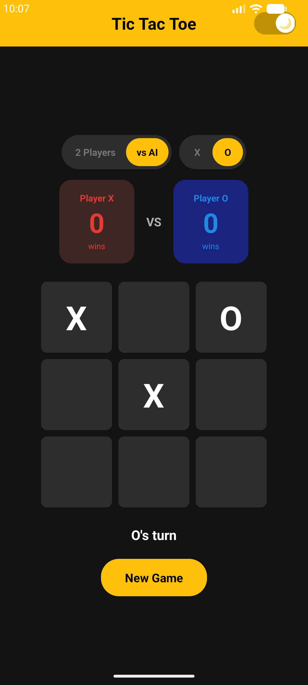
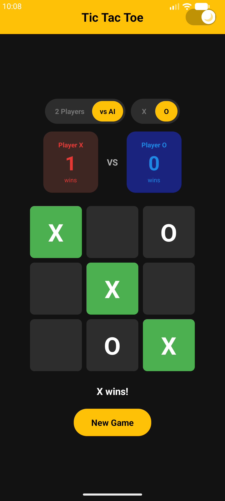

# 🎮 Tic Tac Toe

A modern Tic Tac Toe game for Android with clean UI, smart AI opponent, and dark/light theme support.

## 📸 Screenshots

  
  
  
  

## ✨ Features

- 🎯 **Two Game Modes**
  - 2 Players (PvP) - Play with a friend
  - vs CPU (PvC) - Play against smart AI

- 🤖 **Smart AI Opponent**
  - Tries to win when possible
  - Blocks your winning moves
  - Strategic positioning

- 🎨 **Modern UI**
  - Clean Material Design
  - Smooth animations
  - Yellow accent theme

- 🌓 **Dark & Light Themes**
  - Toggle with sun/moon switch
  - Theme preference saved
  - Smooth transition animation

- 📊 **Score Tracking**
  - Beautiful score cards
  - Persistent across rounds
  - Color-coded (Red for X, Blue for O)

- ✅ **Win Detection**
  - Green highlight on winning cells
  - Draw detection
  - Instant feedback

## 🎮 How to Play

1. **Choose Mode**: Tap "2 Players" or "vs CPU"
2. **Choose Symbol** (PvC only): Tap "X" or "O"
3. **Play**: Tap empty cells to place your mark
4. **Win**: Get 3 in a row (horizontal, vertical, or diagonal)
5. **New Game**: Tap "New Game" to play again

## 📥 Download

**[Download Latest APK](https://github.com/gorguludg/Tic-Tac-Toe-Android/releases/latest)**

Or visit the [Releases page](https://github.com/gorguludg/Tic-Tac-Toe-Android/releases) for all versions.

### Installation Instructions

1. Download the APK from releases
2. Enable "Install from unknown sources" in your device settings
3. Open the APK file and tap Install
4. Enjoy!

**Requirements:** Android 7.0 (Nougat) or higher

## 🛠️ Tech Stack

- **Language:** Kotlin
- **IDE:** Android Studio
- **Min SDK:** API 24 (Android 7.0)
- **UI:** Material Design Components

## 📂 Project Structure
app/src/main/
├── kotlin/com/gorguludg/tictactoe/
│ ├── MainActivity.kt # UI Controller & Theme Logic
│ ├── GameLogic.kt # Game Rules & State
│ └── ComputerAI.kt # AI Opponent Logic
├── res/
│ ├── layout/
│ │ └── activity_main.xml
│ ├── drawable/ # Buttons, cells, cards
│ ├── anim/ # Cell pop animation
│ └── values/
│ ├── colors.xml # Light & dark colors
│ └── themes.xml
└── AndroidManifest.xml

🤖 AI Strategy
The computer opponent uses this decision priority:

Win - Take winning move if available
Block - Block opponent's winning move
Center - Take center cell if available
Corners - Take corner cells
Random - Take any remaining cell

👨‍💻 Author
gorguludg

GitHub: @gorguludg
Web Version: Tic Tac Toe Web